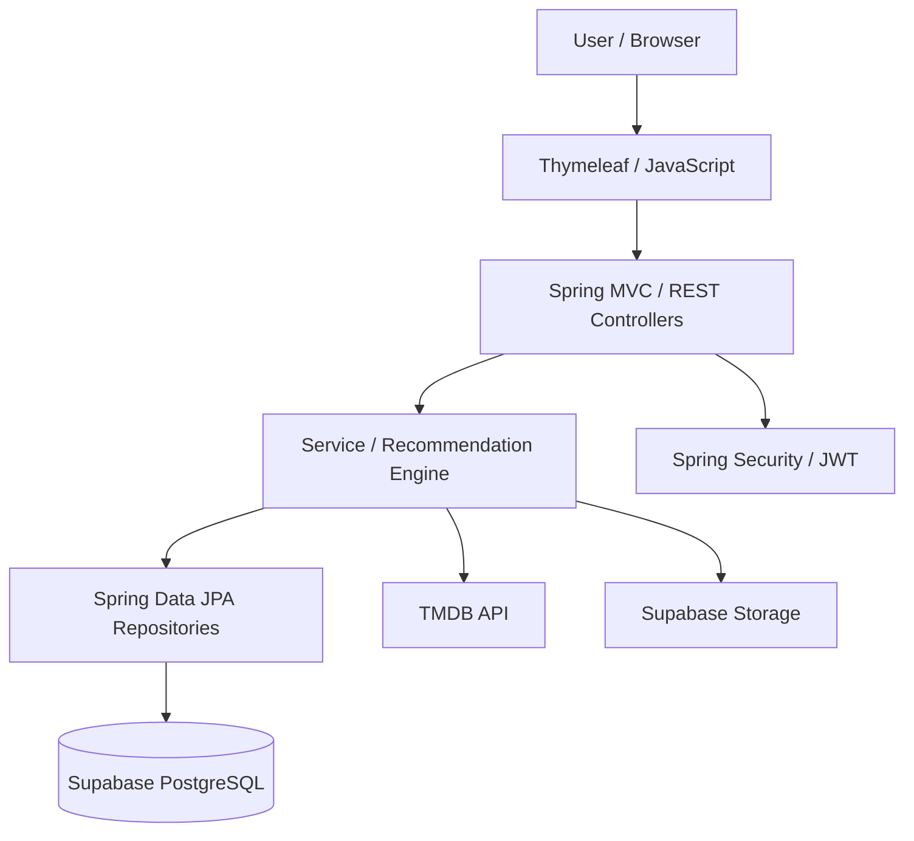

# ระบบแนะนำหนังตามอารมณ์ MovieMood (กลุ่มที่ 8)

MovieMood เป็นเว็บแอปพลิเคชันสำหรับค้นหาและแนะนำภาพยนตร์ตามอารมณ์ โดยใช้ข้อมูลจาก TMDB API  
ผู้ใช้สามารถค้นหา กรอง และดูรายละเอียดภาพยนตร์ รวมถึงรับคำแนะนำผ่าน Recommendation Engine  
ระบบรองรับการสมัครสมาชิก การจัดการโปรไฟล์ Playlist ประวัติการรับชม และประเภทภาพยนตร์ที่ไม่ต้องการ  
พัฒนาด้วย Spring Boot, Thymeleaf, JavaScript และ PostgreSQL บน Supabase

## สมาชิกกลุ่ม (กลุ่มที่ 8)

| ลำดับ | ชื่อ-นามสกุล | รหัสนักศึกษา | Section | Branch | หน้าที่รับผิดชอบ |
|---:|---|---|---|---|---|
| 1 | กนกพร บุญครอง | 673380024-0 | SEC 1 | `kanokporn_6733800240_01` | **User Management & Authentication** — ระบบสมาชิก การสมัคร/เข้าสู่ระบบ โปรไฟล์ การยืนยันตัวตน และ User Preferences |
| 2 | ชิดชนก ชนะพา | 673380033-9 | SEC 1 | `chidchanok_6733800339_01` | **Movie & Mood Management** — ข้อมูลภาพยนตร์ Genre และ Mood รวมถึงการค้นหา กรองข้อมูล และความสัมพันธ์ระหว่าง Mood กับ Genre |
| 3 | ญาทิชา จันทรศรีสุริยวงศ์ | 673380034-7 | SEC 2 | `yathicha_6733800347_02` | **Frontend Development & Integration** — พัฒนาหน้าจอ UI/UX และเชื่อมต่อ Frontend กับ Backend |
| 4 | อรปรีญา แซ่โซ้ง | 673380070-3 | SEC 1 | `onpriya_6733800703_01` | **Watch History, Playlist & Recommendation Engine** — ประวัติการรับชม Playlist, Recommendation Logic, Match Score และ Strategy Pattern |

## Tech Stack

| หมวดหมู่ | เทคโนโลยี |
|---|---|
| Backend | Java 26, Spring Boot 4.1.1, Spring Web MVC |
| Frontend | HTML, CSS, JavaScript, Thymeleaf, Tailwind CSS |
| Database | PostgreSQL (Supabase), Spring Data JPA / Hibernate |
| Authentication | Spring Security, JWT |
| Movie Data | TMDB API |
| File Storage | Supabase Storage |
| Build & Test | Maven Wrapper, Spring Boot Test, H2 |
| Tools & Deployment | Git, GitHub, GitHub Actions, Docker, Docker Compose, Render |

## System Architecture

ระบบแบ่งการทำงานเป็น Controller, Service และ Repository โดยเชื่อมต่อฐานข้อมูล Supabase และ TMDB API




## Database Design (ER Diagram)


ฐานข้อมูลมี Entity หลัก ได้แก่ `User`, `Genre`, `WatchHistory`, `Playlist`, `Movielist`, `PlaylistDetail`, `UserDislikedGenre` และ `PasswordResetToken`

## Installation & Setup

**สิ่งที่ต้องมี:**
- JDK 26 และ Git สำหรับรันผ่าน Maven Wrapper
- PostgreSQL/Supabase และ TMDB API Token
- Docker และ Docker Compose (กรณีรันผ่าน Docker)


1. Clone Repository และเข้าสู่โฟลเดอร์โปรเจกต์:

```bash
git clone https://github.com/YathichaC/movie-mood.git
cd movie-mood/code/movie_mood
```

2. คัดลอกไฟล์ `.env.example` เป็น `.env` แล้วกำหนดค่าการเชื่อมต่อฐานข้อมูล, TMDB API, JWT, Supabase Storage และ SMTP ตามที่ใช้งานจริง:

```powershell
# Windows PowerShell
Copy-Item .env.example .env
```

```bash
# macOS / Linux
cp .env.example .env
```


> **หมายเหตุ:** ให้รันคำสั่งติดตั้งและทดสอบภายในโฟลเดอร์ `code/movie_mood` และไม่ควรเผยแพร่ไฟล์ `.env` หรือ Secret Key ลงใน Repository


Spring Boot อาจไม่โหลด `.env` อัตโนมัติเมื่อรันผ่าน Maven จึงต้องกำหนด Environment Variables ในระบบหรือ IDE ก่อนใช้งาน ทั้งนี้ฐานข้อมูลต้องมี Schema ที่ตรงกับ Entity เนื่องจากตั้งค่า `spring.jpa.hibernate.ddl-auto=validate`


## How to Run

**Maven Wrapper** (หลังตั้งค่า Environment Variables)

**Windows**
```cmd
mvnw.cmd spring-boot:run
```

**macOS / Linux**
```bash
./mvnw spring-boot:run
```

หรือรันผ่าน **Docker Compose** หลังตั้งค่า `.env`

```bash
docker compose up --build
```

เปิดเว็บที่ [http://localhost:8080](http://localhost:8080)

หากต้องการหยุด Docker ให้ใช้คำสั่ง `docker compose down`


## API Documentation

เมื่อรันระบบแล้ว สามารถดูเอกสาร API และรูปแบบ Request/Response ได้ที่:

- [Swagger UI](http://localhost:8080/swagger-ui.html)
- [OpenAPI JSON](http://localhost:8080/v3/api-docs)

ตัวอย่าง API หลักจาก Controller:

| Method | Endpoint | การทำงาน |
|---|---|---|
| POST | `/api/v1/auth/register` | สมัครสมาชิก |
| POST | `/api/v1/auth/login` | เข้าสู่ระบบ |
| GET | `/api/v1/auth/me` | ข้อมูลผู้ใช้ที่เข้าสู่ระบบ |
| GET | `/api/v1/movies/search` | ค้นหาภาพยนตร์ |
| GET | `/api/v1/movies/{tmdbMovieId}` | รายละเอียดภาพยนตร์ |
| GET | `/api/v1/movies/filter/mood` | กรองตามอารมณ์ |
| GET | `/api/v1/moods` | รายการอารมณ์ |
| GET | `/api/v1/recommendations` | แนะนำภาพยนตร์ |
| GET | `/api/v1/playlists` | รายการ Playlist |
| POST | `/api/v1/playlists` | สร้าง Playlist |
| GET | `/api/v1/history` | ประวัติการรับชม |
| PUT | `/api/v1/{userId}/preferences/disliked-genres` | จัดการประเภทภาพยนตร์ที่ไม่ต้องการ |

## How to Run Tests

รันชุดทดสอบด้วย Maven Wrapper จากโฟลเดอร์ `code/movie_mood`:

```cmd
:: Windows
mvnw.cmd test
```

```bash
# macOS / Linux
./mvnw test
```

ชุดทดสอบอยู่ใน `src/test/` ครอบคลุมส่วน Controller, Service, Recommendation Strategy และการเชื่อมต่อข้อมูลภายนอก

## Deployment URL

- **Live Website:** [MovieMood](https://movie-mood-n62i.onrender.com/)
- **Platform:** Render

## Project Structure

```text
movie-mood/
├── .github/workflows/           # CI
├── docs/diagrams/              # UML และ ER Diagram
├── README.md
└── code/movie_mood/
    ├── .env.example
    ├── Dockerfile
    ├── docker-compose.yml
    ├── pom.xml
    ├── mvnw
    ├── mvnw.cmd
    └── src/
        ├── main/
        │   ├── java/com/example/movie_mood/
        │   │   ├── config/
        │   │   ├── controller/
        │   │   ├── domain/
        │   │   ├── dto/
        │   │   ├── facade/
        │   │   ├── integration/tmdb/
        │   │   ├── repository/
        │   │   ├── security/
        │   │   ├── service/
        │   │   └── strategy/
        │   └── resources/
        │       ├── static/
        │       └── templates/
        └── test/
```
