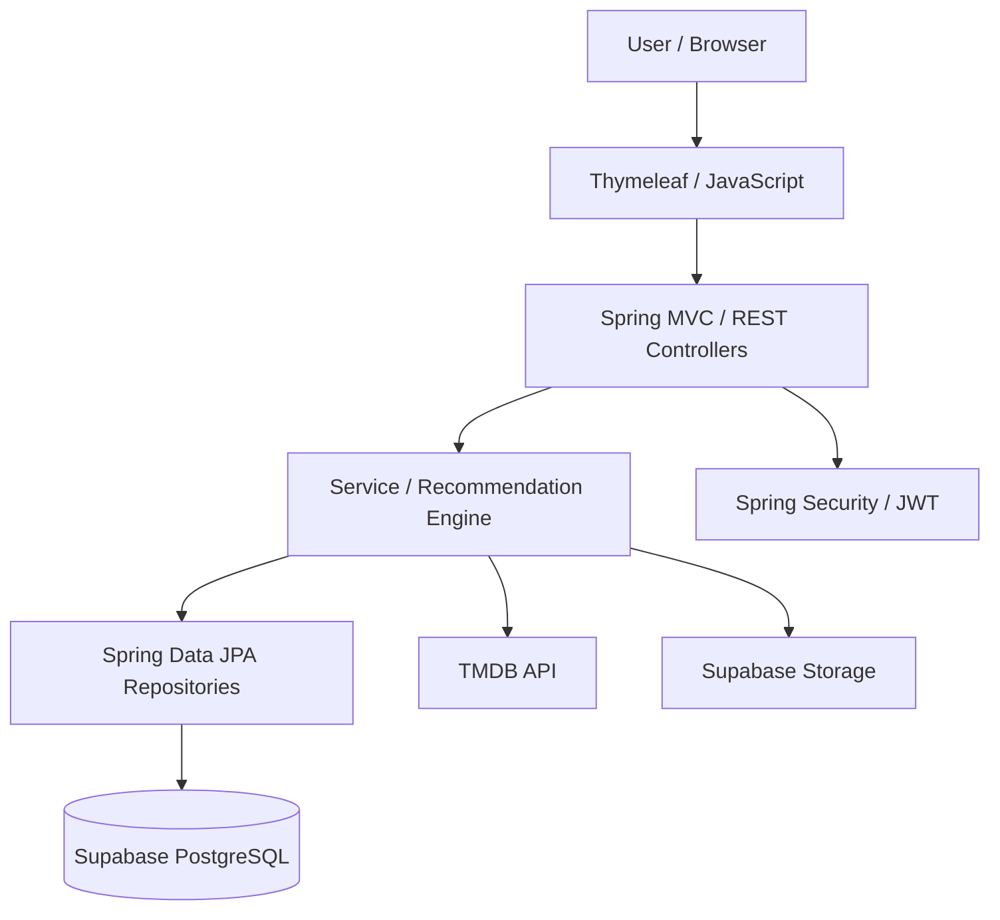
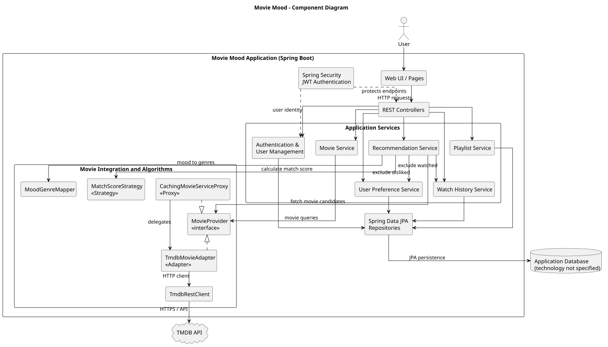
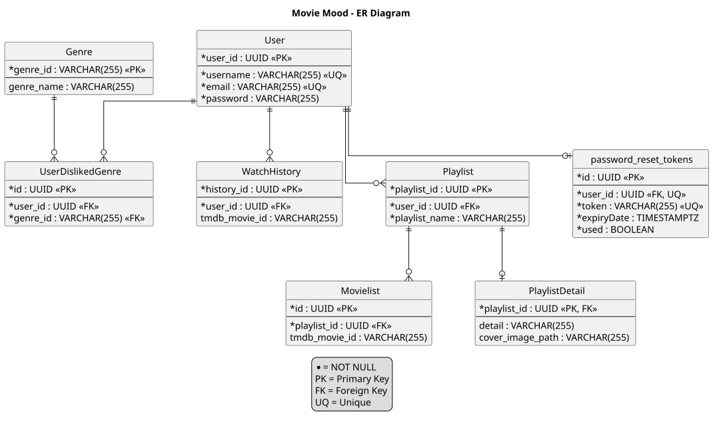

# MovieMood — ระบบแนะนำหนังตามอารมณ์ (กลุ่มที่ 8)

MovieMood เป็นเว็บแอปพลิเคชันสำหรับค้นหาและแนะนำภาพยนตร์ตามอารมณ์ โดยใช้ข้อมูลจาก TMDB API ผู้ใช้สามารถค้นหา กรอง และดูรายละเอียดภาพยนตร์ รวมถึงรับคำแนะนำผ่าน Recommendation Engine

ระบบรองรับการสมัครสมาชิก การเข้าสู่ระบบ การจัดการโปรไฟล์ การค้นหาภาพยนตร์ การจัดการ Playlist ประวัติการรับชม และการตั้งค่าประเภทภาพยนตร์ที่ไม่ต้องการ พัฒนาด้วย Spring Boot, Thymeleaf, JavaScript และ PostgreSQL บน Supabase

## สมาชิกกลุ่ม (กลุ่มที่ 8)

| ลำดับ | ชื่อ-นามสกุล | รหัสนักศึกษา | Section | Branch | หน้าที่รับผิดชอบ |
|---:|---|---|---|---|---|
| 1 | กนกพร บุญครอง | 673380024-0 | SEC 1 | `kanokporn_6733800240_01` | **User Management & Authentication** — ระบบสมาชิก การสมัครและเข้าสู่ระบบ โปรไฟล์ การยืนยันตัวตน และ User Preferences |
| 2 | ชิดชนก ชนะพา | 673380033-9 | SEC 1 | `chidchanok_6733800339_01` | **Movie & Mood Management** — ข้อมูลภาพยนตร์ Genre และ Mood รวมถึงการค้นหา การกรองข้อมูล และความสัมพันธ์ระหว่าง Mood กับ Genre |
| 3 | ญาทิชา จันทรศรีสุริยวงศ์ | 673380034-7 | SEC 2 | `yathicha_6733800347_02` | **Frontend Development & Integration** — พัฒนาหน้าจอ UI/UX และเชื่อมต่อ Frontend กับ Backend |
| 4 | อรปรีญา แซ่โซ้ง | 673380070-3 | SEC 1 | `onpriya_6733800703_01` | **Watch History, Playlist & Recommendation Engine** — ประวัติการรับชม Playlist, Recommendation Logic, Match Score และ Strategy Pattern |

## Tech Stack

| หมวดหมู่ | เทคโนโลยี |
|---|---|
| Backend | Java 26, Spring Boot 4.1.1, Spring Web MVC |
| Frontend | HTML, CSS, JavaScript, Thymeleaf, Tailwind CSS |
| Database | PostgreSQL (Supabase), Spring Data JPA, Hibernate |
| Authentication | Spring Security, JWT |
| Movie Data | TMDB API |
| File Storage | Supabase Storage |
| Build & Test | Maven Wrapper, Spring Boot Test, H2 |
| Tools & Deployment | Git, GitHub, GitHub Actions, Docker, Docker Compose, Render |

## System Architecture

ระบบใช้ Layered Architecture แบ่งการทำงานออกเป็น Controller, Service และ Repository โดยเชื่อมต่อกับฐานข้อมูล PostgreSQL บน Supabase และ TMDB API สำหรับดึงข้อมูลภาพยนตร์ รวมถึงใช้ Spring Security และ JWT สำหรับการรักษาความปลอดภัย



### Component Diagram



## Database Design (ER Diagram)



Entity หลักของระบบประกอบด้วย `User`, `Genre`, `WatchHistory`, `Playlist`, `Movielist`, `PlaylistDetail`, `UserDislikedGenre` และ `PasswordResetToken`

## Installation & Setup

### สิ่งที่ต้องมี

- JDK 26 และ Git
- PostgreSQL/Supabase
- TMDB API Token
- Docker และ Docker Compose (กรณีรันผ่าน Docker)

### 1. Clone Repository

```bash
git clone https://github.com/YathichaC/movie-mood.git
cd movie-mood/code/movie_mood
```

### 2. ตั้งค่า Environment Variables

คัดลอกไฟล์ `.env.example` เป็น `.env` แล้วกำหนดค่าตามการใช้งานจริง เช่น ฐานข้อมูล TMDB API, JWT, Supabase Storage และ SMTP

**Windows PowerShell**

```powershell
Copy-Item .env.example .env
```

**macOS / Linux**

```bash
cp .env.example .env
```

> **หมายเหตุ:** ต้องกำหนด Environment Variables ให้กับระบบหรือ IDE ก่อนรันแอปพลิเคชัน เนื่องจาก Spring Boot ไม่ได้โหลดไฟล์ `.env` โดยอัตโนมัติเมื่อรันผ่าน Maven ในทุกสภาพแวดล้อม

> ห้ามเผยแพร่ไฟล์ `.env`, API Token, Password หรือ Secret Key ลงใน Repository

ฐานข้อมูลต้องมี Schema ที่สอดคล้องกับ Entity เนื่องจากกำหนด `spring.jpa.hibernate.ddl-auto=validate`

## How to Run

รันคำสั่งจากโฟลเดอร์ `code/movie_mood` หลังจากตั้งค่า Environment Variables เรียบร้อยแล้ว

### Maven Wrapper

**Windows**

```cmd
mvnw.cmd spring-boot:run
```

**macOS / Linux**

```bash
./mvnw spring-boot:run
```

### Docker Compose

```bash
docker compose up --build
```

เปิดเว็บไซต์ในเบราว์เซอร์ที่:

[http://localhost:8080](http://localhost:8080)

หากต้องการหยุด Docker Compose ให้ใช้คำสั่ง:

```bash
docker compose down
```

## API Documentation

เมื่อรันระบบแล้ว สามารถดูเอกสาร API และรูปแบบ Request/Response ได้ที่:

- [Swagger UI](http://localhost:8080/swagger-ui.html)
- [OpenAPI JSON](http://localhost:8080/v3/api-docs)

### ตัวอย่าง API หลัก

| Method | Endpoint | การทำงาน |
|---|---|---|
| POST | `/api/v1/auth/register` | สมัครสมาชิก |
| POST | `/api/v1/auth/login` | เข้าสู่ระบบ |
| GET | `/api/v1/auth/me` | ดูข้อมูลผู้ใช้ที่เข้าสู่ระบบ |
| GET | `/api/v1/movies/search` | ค้นหาภาพยนตร์ |
| GET | `/api/v1/movies/{tmdbMovieId}` | ดูรายละเอียดภาพยนตร์ |
| GET | `/api/v1/movies/filter/mood` | กรองภาพยนตร์ตามอารมณ์ |
| GET | `/api/v1/moods` | ดูรายการอารมณ์ |
| GET | `/api/v1/recommendations` | แนะนำภาพยนตร์ |
| GET | `/api/v1/playlists` | ดูรายการ Playlist |
| POST | `/api/v1/playlists` | สร้าง Playlist |
| GET | `/api/v1/history` | ดูประวัติการรับชม |
| PUT | `/api/v1/{userId}/preferences/disliked-genres` | จัดการประเภทภาพยนตร์ที่ไม่ต้องการ |

> รายการข้างต้นเป็นตัวอย่าง Endpoint สำหรับอ้างอิง ควรตรวจสอบกับ Controller และ Swagger UI ของเวอร์ชันที่ deploy จริงอีกครั้งก่อนใช้งาน

## How to Run Tests

รันชุดทดสอบด้วย Maven Wrapper จากโฟลเดอร์ `code/movie_mood`

**Windows**

```cmd
mvnw.cmd test
```

**macOS / Linux**

```bash
./mvnw test
```

ชุดทดสอบอยู่ภายใน `src/test/` โดยใช้ Spring Boot Test, JUnit และ Mockito ตามที่กำหนดในโปรเจกต์ เพื่อทดสอบส่วน Controller, Service, Recommendation Strategy และการทำงานร่วมกับส่วนต่าง ๆ ของระบบ

## Deployment

- **Live Website:** [MovieMood](https://moviemood.dev/)
- **Hosting Platform:** Render
- **Source Code:** [GitHub Repository](https://github.com/YathichaC/movie-mood)

## Project Structure

```text
movie-mood/
├── .github/
│   └── workflows/
│       └── ci.yml
├── code/
│   └── movie_mood/
│       ├── .mvn/
│       ├── .env.example
│       ├── src/
│       │   ├── main/
│       │   │   ├── java/com/example/movie_mood/
│       │   │   │   ├── config/
│       │   │   │   ├── controller/
│       │   │   │   ├── domain/
│       │   │   │   ├── dto/
│       │   │   │   ├── exception/
│       │   │   │   ├── facade/
│       │   │   │   ├── integration/
│       │   │   │   ├── mapper/
│       │   │   │   ├── repository/
│       │   │   │   ├── security/
│       │   │   │   ├── service/
│       │   │   │   └── strategy/
│       │   │   └── resources/
│       │   │       ├── static/
│       │   │       ├── templates/
│       │   │       └── application.properties
│       │   └── test/
│       │       ├── java/
│       │       └── resources/
│       ├── pom.xml
│       ├── Dockerfile
│       ├── docker-compose.yml
│       ├── mvnw
│       └── mvnw.cmd
├── docs/
│   └── diagrams/
│       ├── png/
│       └── svg/
├── doc/
├── img/
│   ├── 01-home.png
│   ├── 02-movie-search.png
│   ├── 03-recommendation.png
│   ├── 04-playlist.png
│   └── 05-watch-history.png
├── test/
│   ├── images/
│   └── test-report.md
└── README.md
```

> โครงสร้างข้างต้นเป็นภาพรวมของโปรเจกต์ ควรตรวจสอบชื่อโฟลเดอร์และไฟล์จริงใน Repository อีกครั้ง โดยเฉพาะ `integration/`, `mapper/`, `doc/`, `img/` และไฟล์รายงานทดสอบ

## Design Patterns

MovieMood นำแนวคิดการออกแบบซอฟต์แวร์และ Design Patterns มาใช้เพื่อแยกความรับผิดชอบและเพิ่มความยืดหยุ่นในการพัฒนา เช่น

- **Layered Architecture:** แยก Controller, Service และ Repository
- **Strategy Pattern:** รองรับการแยกกลยุทธ์การแนะนำภาพยนตร์
- **Adapter Pattern:** ใช้ปรับรูปแบบการเชื่อมต่อกับ TMDB API ให้เข้ากับระบบ
- **Facade Pattern:** รวมการทำงานที่ซับซ้อนไว้ภายใต้ Interface ที่ใช้งานง่าย
- **Proxy Pattern:** รองรับการเพิ่มชั้นการทำงานระหว่างระบบกับบริการภาพยนตร์ภายนอก เช่น การจัดการ Cache

การใช้งานแต่ละ Pattern ควรอ้างอิงจากคลาสที่มีอยู่จริงใน Repository

## License

โปรเจกต์นี้พัฒนาขึ้นเพื่อการศึกษาในรายวิชา Principles of Software Design and Development
