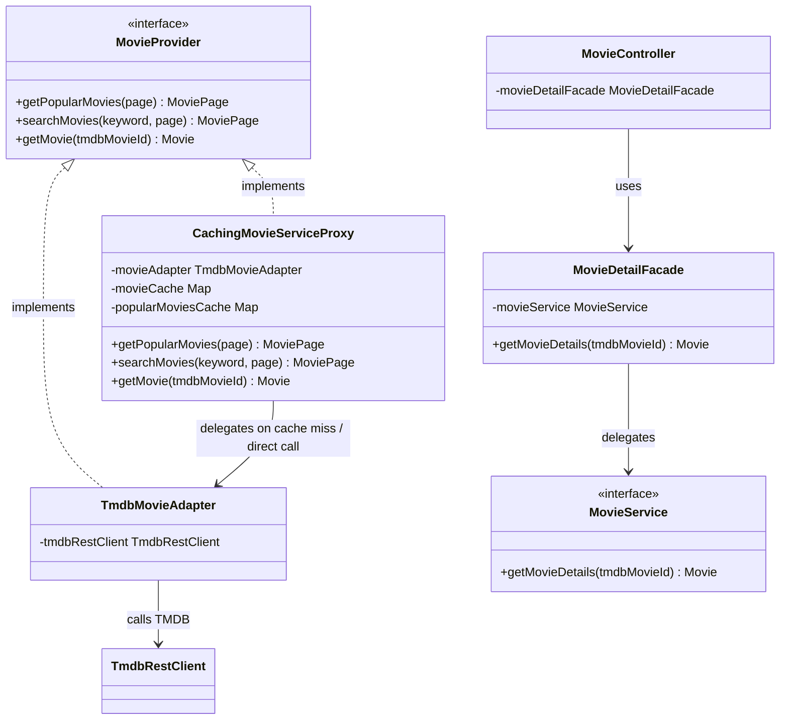

# Design Patterns

## Enterprise / Architectural Patterns

| Pattern | ใช้ที่ไหน |
|---|---|
| **Layered Architecture** | แยกหน้าที่ตาม package `controller/` → `service/` และ `service/impl/` → `repository/` → `domain/` สำหรับรับ Request, ประมวลผล Business Logic และจัดการข้อมูล โดยบาง Service เรียก `integration/tmdb/` แทน Repository |
| **MVC** | `controller/web/PageController.java` เป็น Controller, `domain/model/Movie.java` เป็น Domain Model และ `src/main/resources/templates/` เป็น View สำหรับหน้าเว็บ ส่วน `controller/api/` ใช้ Spring Web MVC ส่ง JSON Response |
| **Repository Pattern** | `repository/PlaylistRepository.java` และ `repository/WatchHistoryRepository.java` เป็นตัวอย่าง Repository ที่ใช้ Spring Data JPA แยกการเข้าถึงฐานข้อมูลออกจาก Service |
| **Service Layer Pattern** | `service/RecommendationService.java`, `service/impl/RecommendationServiceImpl.java` และ `service/impl/PlaylistServiceImpl.java` แยก Business Logic ออกจาก Controller |
| **DTO Pattern + Mapper** | `dto/response/MovieResponse.java` และ `mapper/MovieMapper.java` แปลงข้อมูล `Movie` เป็น DTO สำหรับ API Response โดยไม่ส่ง Domain Model ออกไปโดยตรง |
| **Dependency Injection** | `controller/api/RecommendationController.java`, `service/impl/RecommendationServiceImpl.java` และ `integration/tmdb/TmdbMovieAdapter.java` รับ Dependency ผ่าน Constructor โดย Spring เป็นผู้จัดการ Object |

## GoF Patterns (กลุ่ม Structural — 3 แบบ)

| Pattern | ปัญหาที่แก้ | ไฟล์/คลาสที่ใช้ | Diagram อ้างอิง |
|---|---|---|---|
| **Adapter** | รูปแบบ Response ของ TMDB API ไม่ตรงกับ Domain Model ภายใน Movie Mood | `integration/tmdb/MovieProvider.java` (interface), `integration/tmdb/TmdbMovieAdapter.java`, `integration/tmdb/TmdbRestClient.java` — Adapter เรียก TMDB และแปลงข้อมูลภายนอกเป็น `Movie` หรือ `MoviePage` ให้ส่วนอื่นเรียกผ่าน `MovieProvider` | [Structural Diagram](#structural-diagram) |
| **Facade (แบบเรียบง่าย)** | ลดการผูก Controller กับรายละเอียดการเรียก Service สำหรับข้อมูลภาพยนตร์ | `facade/MovieDetailFacade.java`, `controller/api/MovieController.java` — Facade เปิดเมธอด `getMovieDetails(String tmdbMovieId)` และส่งต่อไปยัง `MovieService.getMovieDetails(...)` ปัจจุบันยังประสานงานเพียง Service เดียว | [Structural Diagram](#structural-diagram) |
| **Proxy (Caching Proxy)** | ลดการเรียก TMDB API ซ้ำสำหรับข้อมูลบางประเภท และนำผลลัพธ์ที่ยังไม่หมดอายุมาใช้ซ้ำ | `integration/tmdb/proxy/CachingMovieServiceProxy.java`, `integration/tmdb/MovieProvider.java`, `integration/tmdb/TmdbMovieAdapter.java` — Proxy ใช้ Interface `MovieProvider` เดียวกับ Adapter ตรวจ Cache สำหรับบางเมธอดก่อนส่งต่อ; `searchMovies()` ส่งต่อโดยตรงโดยไม่ Cache | [Structural Diagram](#structural-diagram) |

## Class Diagrams ประกอบ

### Structural Diagram

