# MovieMood — Test Report

## 1. ข้อมูลการทดสอบ

- **Project:** MovieMood
- **Technology:** Java, Spring Boot, Maven, JUnit 5, Mockito
- **Test Execution:** PowerShell / Maven Wrapper (`mvnw.cmd`) และ HTTP Requests (`curl.exe`)
- **Evidence Directory:** `test/images/`

## 2. สรุปผลการทดสอบ

| ประเภทการทดสอบ | ผลที่ตรวจสอบได้ | สถานะ |
|---|---|---|
| Automated Tests (Maven) | 118 tests, 0 failures, 0 errors, 0 skipped | **PASS** |
| `RecommendationServiceImplTest` | 6 tests ผ่านในการรันชุดรวม | **PASS (Full Suite)** |
| `PlaylistServiceTest` | 9 tests ผ่านในการรันชุดรวม | **PASS (Full Suite)** |
| `WatchHistoryServiceTest` | 7 tests ผ่านในการรันชุดรวม | **PASS (Full Suite)** |
| `UserPreferenceServiceTest` | 8 tests ผ่านในการรันชุดรวม | **PASS (Full Suite)** |
| `RecommendationStrategyTest` | 1 test ผ่านในการรันชุดรวม | **PASS (Full Suite)** |
| `AuthServiceTest` | มีภาพหลักฐานการทดสอบแยก | **Evidence Available** |
| `TmdbMovieAdapterTest` | มีภาพหลักฐานการทดสอบแยก | **Evidence Available** |
| `CachingMovieServiceProxyTest` | มีภาพหลักฐานการทดสอบแยก | **Evidence Available** |
| `MovieMoodApplicationTests` (`@SpringBootTest`) | ผู้ทดสอบยืนยันว่ารันแยกผ่าน | **PASS (Reported)** |
| REST API — Movies | 4 HTTP Status Checks ผ่าน | **PASS** |
| REST API — Moods (ไม่ส่ง JWT) | ได้ HTTP 403 | **Needs Review** |
| Database CRUD Integration Test | ยังไม่มีหลักฐานยืนยัน | **Not Verified** |

> **ข้อจำกัด:** Automated Tests จำนวน 118 รายการเป็นผลจากการรัน Maven ทั้งชุด ส่วน REST API Tests จำนวน 4 รายการเป็นการตรวจสอบ HTTP Status Code แยกต่างหาก จึงไม่ควรนำมารวมเป็น Automated Tests 122 รายการ

## 3. Automated Testing (JUnit 5 / Mockito)

### 3.1 Full Test Suite

**คำสั่งที่ใช้**

```powershell
cd C:\Users\User\movie-mood\code\movie_mood
.\mvnw.cmd clean test
```

**ผลการทดสอบที่บันทึกไว้**

```text
Tests run: 118, Failures: 0, Errors: 0, Skipped: 0
BUILD SUCCESS
```

**ผล:** PASS — Automated Tests ทั้งหมดผ่าน ไม่มี Failure, Error หรือ Skipped

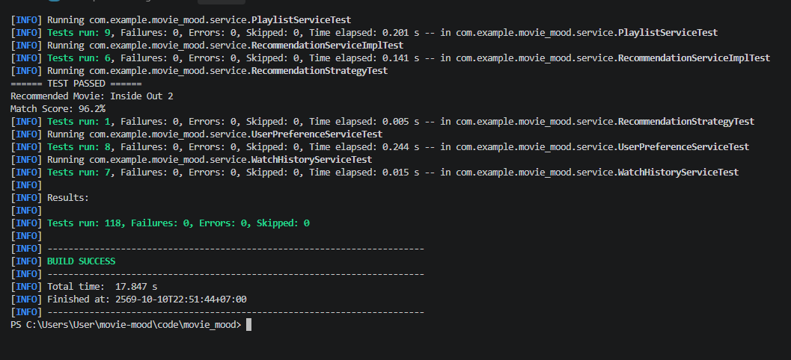

### 3.2 Recommendation Service

`RecommendationServiceImplTest` มีผลผ่าน 6 tests จากการรันชุดรวม ใช้ทดสอบส่วน Service ที่เกี่ยวข้องกับการแนะนำภาพยนตร์

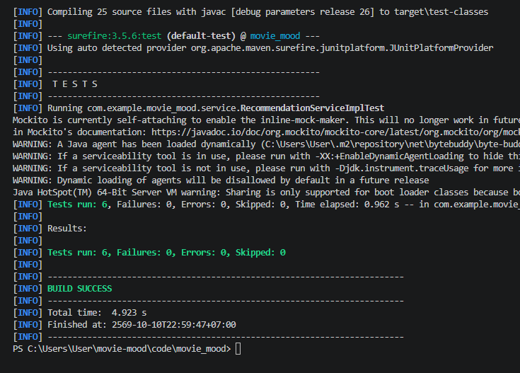

### 3.3 Playlist Service

`PlaylistServiceTest` มีผลผ่าน 9 tests จากการรันชุดรวม

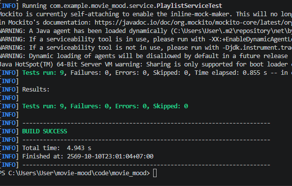

### 3.4 Authentication Service

มีการเก็บภาพหลักฐานการรัน `AuthServiceTest` แยก โดยให้ยึดจำนวน Test Cases และผลการรันตามที่แสดงในภาพ ไม่ระบุจำนวนหรือสถานะ PASS เพิ่มเติมโดยไม่มีข้อมูลผลรันที่ยืนยันได้

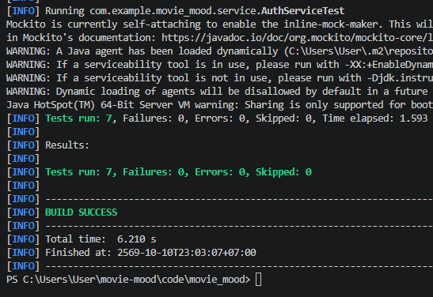

### 3.5 TMDB Adapter / Cache Proxy

มีภาพหลักฐานการทดสอบส่วนประกอบที่เกี่ยวข้องกับการเชื่อมต่อบริการภายนอกและ Design Patterns ได้แก่ `TmdbMovieAdapterTest` และ `CachingMovieServiceProxyTest`

**TMDB Adapter**

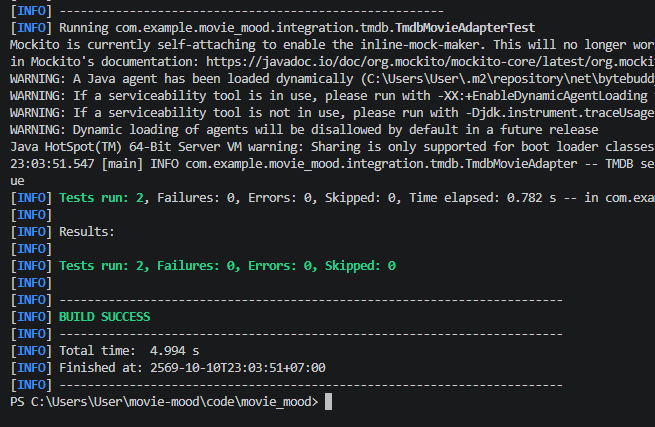

**Cache Proxy**

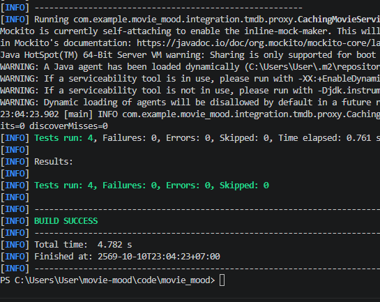

### 3.6 Watch History Service

`WatchHistoryServiceTest` มีผลผ่าน 7 tests จากการรันชุดรวม

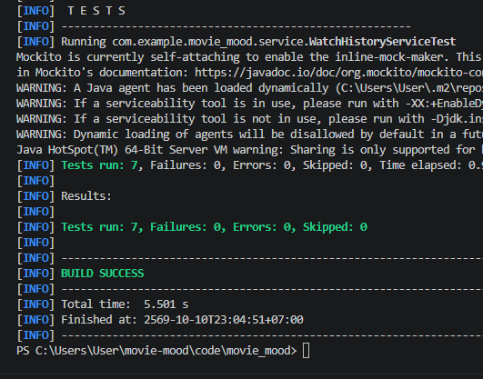

### 3.7 User Preference Service

`UserPreferenceServiceTest` มีผลผ่าน 8 tests จากการรันชุดรวม

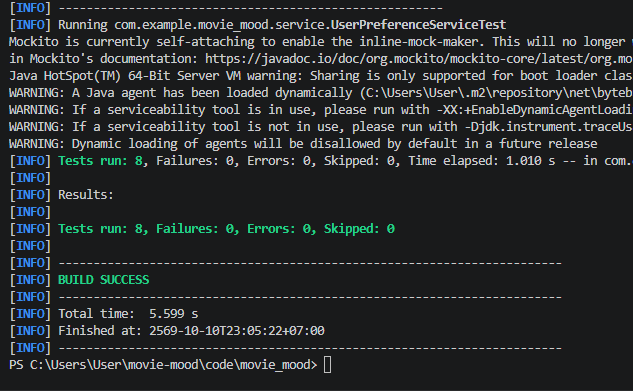

## 4. Spring Boot Application Context Test

ตรวจพบ `@SpringBootTest` ใน `MovieMoodApplicationTests.java` โดยผู้ทดสอบยืนยันว่ารันคลาสนี้แยกแล้วผ่าน

**คำสั่ง**

```powershell
.\mvnw.cmd "-Dtest=MovieMoodApplicationTests" test
```

**ผล:** PASS (ตามผลที่ผู้ทดสอบยืนยัน)

**ขอบเขต:** การใช้ `@SpringBootTest` แสดงว่ามีการทดสอบด้วย Spring Application Context แต่ไม่ได้ยืนยันด้วยตัวมันเองว่ามีการทดสอบ CRUD กับฐานข้อมูลจริงโดยตรง

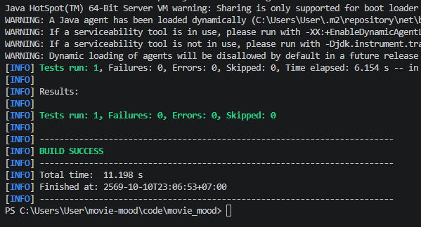

## 5. REST API Testing

ทดสอบด้วย `curl.exe` ผ่าน `http://localhost:8080` โดยตรวจสอบ HTTP Status Code ที่ตอบกลับจริง

### 5.1 Movie API

| Test ID | Test Case | Method / Endpoint | Expected | Actual | Result |
|---|---|---|---|---|---|
| API-01 | Browse Movies | `GET /api/v1/movies` | HTTP 200 | HTTP 200 | **PASS** |
| API-02 | Search Movies | `GET /api/v1/movies/search?keyword=batman` | HTTP 200 | HTTP 200 | **PASS** |
| API-03 | Search with Pagination | `GET /api/v1/movies/search?keyword=batman&page=1` | HTTP 200 | HTTP 200 | **PASS** |
| API-04 | Invalid Search (blank keyword) | `GET /api/v1/movies/search?keyword=` | HTTP 400 | HTTP 400 | **PASS** |

**Summary:** 4/4 HTTP Status Checks PASS, 0 FAIL

**คำสั่งที่ใช้**

```powershell
curl.exe -s -o NUL -w "HTTP Status: %{http_code}`n" "http://localhost:8080/api/v1/movies"

curl.exe -s -o NUL -w "HTTP Status: %{http_code}`n" "http://localhost:8080/api/v1/movies/search?keyword=batman"

curl.exe -s -o NUL -w "HTTP Status: %{http_code}`n" "http://localhost:8080/api/v1/movies/search?keyword=batman&page=1"

curl.exe -s -o NUL -w "HTTP Status: %{http_code}`n" "http://localhost:8080/api/v1/movies/search?keyword="
```

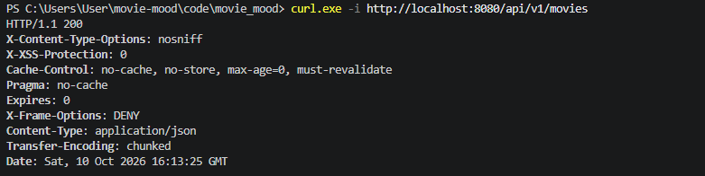

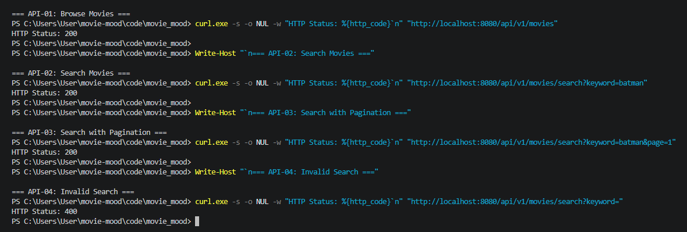

**ข้อจำกัด:** คำสั่งข้างต้นตรวจสอบเฉพาะ HTTP Status Code ไม่ได้ตรวจสอบเนื้อหา JSON จำนวนภาพยนตร์ หรือความถูกต้องของข้อมูลที่ส่งกลับ

### 5.2 Mood API — Access Control Observation

ทดสอบ `GET /api/v1/moods` โดยไม่ส่ง JWT แล้วได้รับ `HTTP 403 Forbidden` สองครั้ง

ผลดังกล่าวอาจเกิดจากข้อกำหนดด้านสิทธิ์การเข้าถึง แต่ยังไม่สามารถสรุปว่าเป็น PASS หรือ Bug ได้จนกว่าจะตรวจสอบ Security Configuration และพฤติกรรมที่ระบบออกแบบไว้

| Endpoint | Request | Actual | Status |
|---|---|---|---|
| `GET /api/v1/moods` | ไม่มี JWT | HTTP 403 | **NEEDS REVIEW** |

## 6. ข้อสรุปและข้อจำกัด

จากผลการทดสอบที่บันทึกไว้ MovieMood มีผล Automated Tests ผ่าน **118/118 tests** โดยไม่มี Failure, Error หรือ Skipped และมีผล REST API สำหรับ Browse/Search Movies ผ่าน **4/4 HTTP Status Checks**

นอกจากนี้ ผู้ทดสอบยืนยันว่า Spring Boot Application Context Test รันผ่าน และมีภาพหลักฐานสำหรับการทดสอบ Service, Authentication, TMDB Adapter และ Cache Proxy ตามรายการที่ระบุ

อย่างไรก็ตาม ยังมีข้อจำกัดที่ต้องตรวจสอบเพิ่มเติมดังนี้

1. **Database CRUD Integration Test:** ยังไม่มีหลักฐานยืนยันการทดสอบ CRUD กับฐานข้อมูลจริง
2. **API Response Validation:** ยังไม่มีหลักฐานยืนยันการตรวจสอบความถูกต้องของ JSON Response และข้อมูลที่ส่งกลับ
3. **Mood API Access Control:** ต้องตรวจสอบว่า HTTP 403 เมื่อไม่ส่ง JWT เป็นพฤติกรรมที่ระบบกำหนดไว้หรือไม่
4. **Frontend End-to-End Testing:** ยังไม่มีผลทดสอบยืนยันการทำงานครบทั้งกระบวนการผ่านเบราว์เซอร์
5. **Individual Test Evidence:** จำนวนและผลการทดสอบแยกของ Authentication Service, TMDB Adapter และ Cache Proxy ควรอ้างอิงจากผลรันจริงของแต่ละคลาส

ดังนั้น รายงานนี้สรุปเฉพาะผลการทดสอบที่มีข้อมูลหรือหลักฐานรองรับ และไม่ถือว่าการทดสอบที่ยังไม่มีหลักฐานยืนยันผ่านแล้ว
